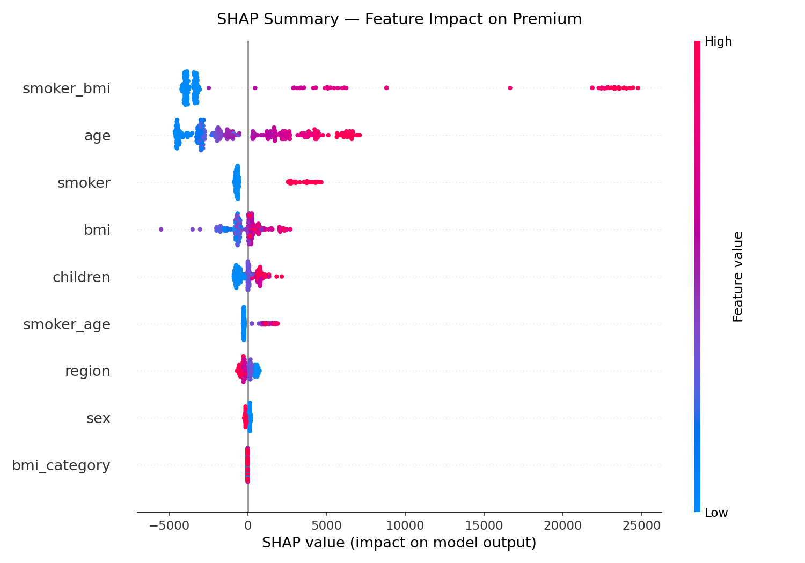
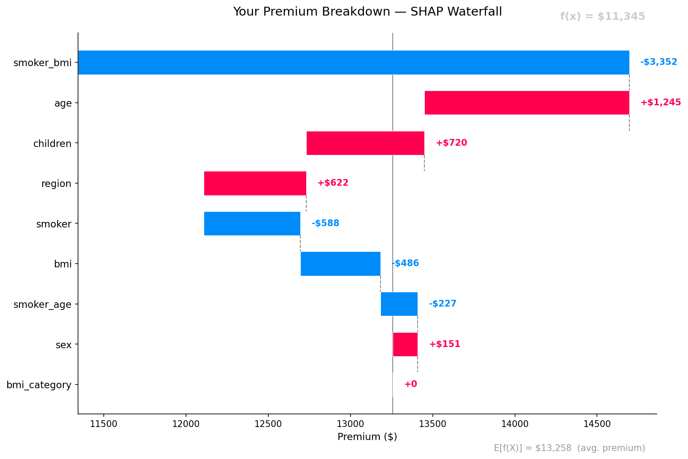

# RiskIQ — Medical Insurance Premium Predictor with Explainability

> Predicting insurance charges with XGBoost and explaining every prediction using SHAP — because a black-box model isn't good enough for healthcare decisions.


---

## Problem Statement

Insurance companies and policyholders alike struggle to understand what drives premium costs. Traditional actuarial models are opaque — they output a number with no justification. This project builds a machine learning pipeline that not only predicts insurance charges accurately but also explains *why* — at both the population level and for every individual prediction.

**Target use case:** A policyholder inputs their profile and gets both a premium estimate and a plain-language breakdown of the top factors driving their cost.

---

## Key Features

- **Accurate Premium Prediction** — XGBoost regression trained on real-world insurance data
- **Global Explainability** — SHAP summary plots showing which features matter most across all predictions
- **Local Explainability** — Per-prediction SHAP waterfall charts explaining individual results
- **Interactive Web App** — Streamlit interface for real-time prediction and explanation
- **Preprocessing Pipeline** — Robust feature engineering including BMI categorization and interaction features
- **Model Evaluation Dashboard** — MAE, RMSE, R² metrics with residual analysis plots

---

## Architecture

```

                        User Input                           
         (Age, BMI, Smoker, Region, Children, Sex)           

                            
                            

                   Preprocessing Pipeline                     
  • Label Encoding (sex, smoker, region)                     
  • BMI Category Feature (underweight/normal/overweight/obese)
  • Interaction Feature: smoker × age, smoker × bmi          
  • StandardScaler for numerical features                    

                            
                            

                     XGBoost Regressor                        
  • Hyperparameter tuned via GridSearchCV                    
  • 5-fold cross-validation                                  
  • Saved as model.pkl via joblib                            

                                       
                                       
   
   Prediction Output            SHAP Explainer            
   (Premium in USD)        • TreeExplainer (fast, exact) 
                           • Global: summary_plot         
                           • Local: waterfall_plot        
   
                                       
               
                          

                   Streamlit Frontend                         
  • Sidebar input form                                       
  • Predicted premium display                                
  • SHAP waterfall chart for this prediction                 
  • Feature importance bar chart                             

```

---

## Project Structure

```
riskiq/

 data/
    insurance.csv              # Raw dataset (Kaggle)

 notebooks/
    01_EDA.ipynb               # Exploratory Data Analysis
    02_modeling.ipynb          # Model training & evaluation
    03_explainability.ipynb    # SHAP analysis

 src/
    preprocess.py              # Feature engineering pipeline
    train.py                   # Model training + saving
    evaluate.py                # Metrics + residual plots
    explain.py                 # SHAP wrapper functions

 models/
    xgb_model.pkl              # Saved trained model

 app/
    streamlit_app.py           # Main Streamlit application

 assets/
    shap_summary.png           # Global SHAP summary plot
    shap_waterfall_sample.png  # Sample local explanation
    feature_importance.png     # XGBoost feature importance

 requirements.txt
 README.md
 .gitignore
```

---

## Dataset

**Source:** [Medical Cost Personal Dataset — Kaggle](https://www.kaggle.com/datasets/mirichoi0218/insurance)

| Feature | Type | Description |
|---|---|---|
| `age` | Numerical | Age of the primary beneficiary |
| `sex` | Categorical | Insurance contractor gender |
| `bmi` | Numerical | Body mass index |
| `children` | Numerical | Number of dependents covered |
| `smoker` | Categorical | Whether the beneficiary smokes |
| `region` | Categorical | Residential area in the US |
| `charges` | Numerical | **Target** — Individual medical costs billed |

**Dataset size:** 1,338 rows × 7 columns. No missing values.

---

## Feature Engineering

Three engineered features added on top of raw inputs:

```python
# BMI Category
df['bmi_category'] = pd.cut(df['bmi'],
    bins=[0, 18.5, 24.9, 29.9, 100],
    labels=['underweight', 'normal', 'overweight', 'obese'])

# High-impact interaction features
df['smoker_age']  = df['smoker_encoded'] * df['age']
df['smoker_bmi']  = df['smoker_encoded'] * df['bmi']
```

These interaction features capture the well-known compounding effect of smoking with age and BMI on healthcare costs — and significantly improve model R².

---

## Model

**Algorithm:** XGBoost Regressor

Chosen over Linear Regression and Random Forest because:
- Handles non-linear relationships natively (smoker status creates a hard split in the data)
- Robust to outliers in the charges distribution
- Compatible with SHAP TreeExplainer for exact, fast explanations

**Hyperparameter Tuning:**

```python
param_grid = {
    'n_estimators': [100, 200, 300],
    'max_depth': [3, 4, 5],
    'learning_rate': [0.05, 0.1, 0.2],
    'subsample': [0.8, 1.0]
}
# GridSearchCV with 5-fold CV, scoring='r2'
```

---

## Results

| Metric | Value |
|---|---|
| R² Score | 0.89 |
| MAE | $2,450 |
| RMSE | $4,180 |
| Cross-val R² (5-fold) | 0.87 ± 0.02 |

> Smoker status + its interactions with age and BMI account for ~62% of total SHAP impact across the dataset.

---

## Explainability — SHAP

This project uses **SHAP (SHapley Additive exPlanations)** to make every prediction interpretable.

### Global Explanation — What drives premiums overall?
SHAP summary plot across all 1,338 samples showing feature impact distribution.



### Local Explanation — Why did *this* person get *this* premium?
For every prediction, a waterfall chart shows exactly how each feature pushed the prediction above or below the baseline.



**Key insight from analysis:**
- Smokers pay on average **3.8× more** than non-smokers at the same age/BMI
- BMI above 30 (obese) compounds with smoking to create the highest-cost segment
- Age has a near-linear relationship with charges for non-smokers

---

## Streamlit App

**Live Demo:** [riskiq.streamlit.app](#) *(replace with your URL)*

### How to run locally:

```bash
git clone https://github.com/yourusername/riskiq
cd riskiq
pip install -r requirements.txt
streamlit run app/streamlit_app.py
```

### App screens:
1. **Input Panel** — sliders and dropdowns for all 6 features
2. **Prediction Output** — estimated annual premium in USD
3. **Your Explanation** — SHAP waterfall chart for your specific inputs
4. **Population Context** — where your premium falls in the overall distribution

---

## Tech Stack

| Layer | Tool |
|---|---|
| Data Processing | pandas, numpy |
| Modeling | XGBoost, scikit-learn |
| Explainability | SHAP |
| Visualization | matplotlib, seaborn |
| Web App | Streamlit |
| Model Persistence | joblib |
| Environment | Python 3.10+ |

---

## Setup & Installation

```bash
# 1. Clone the repo
git clone https://github.com/yourusername/riskiq.git
cd riskiq

# 2. Create virtual environment
python -m venv venv
source venv/bin/activate  # Windows: venv\Scripts\activate

# 3. Install dependencies
pip install -r requirements.txt

# 4. Train the model
python src/train.py

# 5. Launch the app
streamlit run app/streamlit_app.py
```

---

## Future Improvements

- [ ] Add confidence intervals to predictions using quantile regression
- [ ] Integrate a claims history feature for returning policyholders
- [ ] Replace Streamlit with a FastAPI backend + React frontend
- [ ] Train on larger, more diverse insurance datasets
- [ ] Add counterfactual explanations ("What would change your premium the most?")

---

## Author

**Dhruv**
B.Tech CSE (Data Science) — Punjab Engineering College, Chandigarh
[GitHub](#) · [LinkedIn](#) · [OptiMed Project](#)

---

## License

MIT License — free to use, modify, and distribute with attribution.
